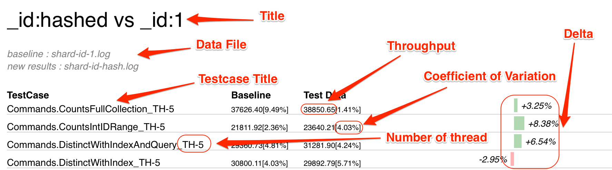

# mongocmp

To compare output of mongo-perf and output to Go's benchcmp format for visualizeion

# How to use

First install mongocmp and my fork of benchviz

<pre>
go install github.com/rzh/utils/go/mongocmp
go install github.com/rzh/svgo/benchviz
</pre>

To compare test results
<pre>
go run mongocmp.go baseline.log new.log   | benchviz -vp=735 -h 1680 -w 1058 -line -vw 180 -title="sharded vs standalone" > sharded_perf.svg
</pre>

# How to read output

Here is the output SVG and how to read it

# Use -wiki output

mongocmp can directly output Jira/Wiki friendly output. Specify it with -wiki=true, such as

<pre>
go run mongocmp.go -wiki=true baseline.log new.log
</pre>
